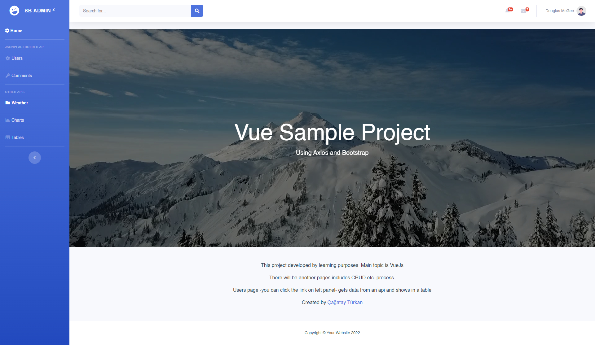
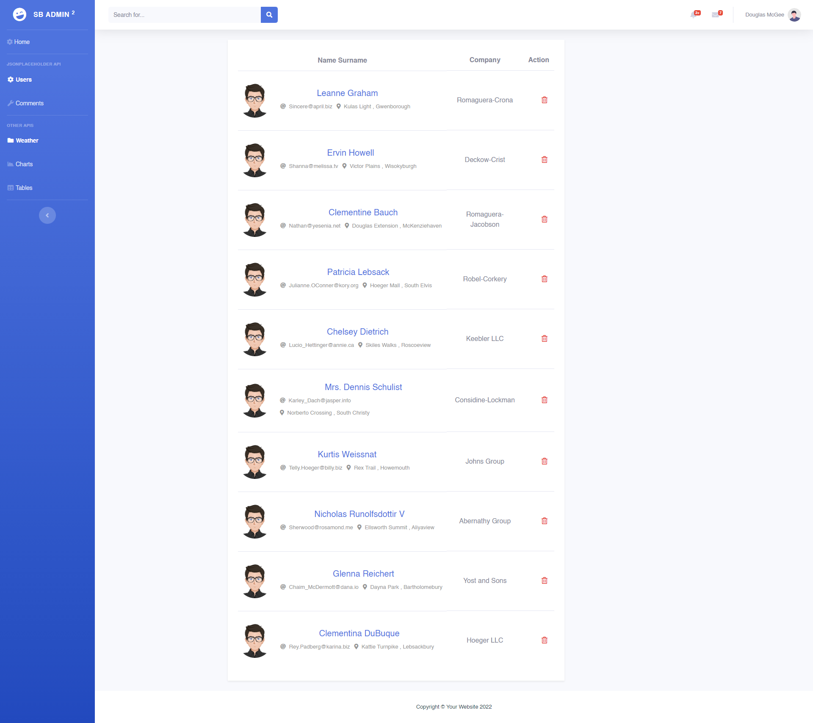

<h1>VueJS Sample Project</h1>

In this project I changed a free dashboard template which is made by bootstrap, css, scss etc. technologies to VueJs. Some components added and changed. There are some pages includes data process. There will be more. 
<ul>
<li>Users Page - </li>
</ul>

<h2>Application Visuals</h2>



<h3>Used Technologies</h3>
<ul>
<li>VueJs</li>
<li>Bootstrap</li>
<li>Axios</li>

## Project setup
```
npm install
```

### Compiles and hot-reloads for development
```
npm run serve
```

### Compiles and minifies for production
```
npm run build
```

### Lints and fixes files
```
npm run lint
```

### Customize configuration
See [Configuration Reference](https://cli.vuejs.org/config/).
